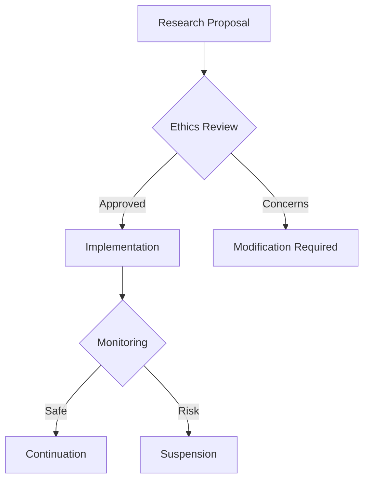

# Quantum-Inspired Artificial Life Network (QIALN)

## System Architecture Overview

A decentralized platform enabling the creation, evolution, and study of quantum-inspired artificial life forms with robust ethical guidelines.

### Core Components

#### 1. Life Form Framework
```
├── Entity Structure
│   ├── Quantum Gene Encoding
│   │   ├── Superposition States
│   │   └── Entanglement Patterns
│   └── Phenotype Expression
└── Evolution Engine
    ├── Quantum Mutation Handler
    └── Fitness Evaluator
```

#### 2. Smart Contract Infrastructure
```solidity
contract ArtificialLife {
    struct Organism {
        uint256 organismId;
        bytes32 genomeHash;
        uint16 generation;
        address creator;
        uint256 fitness;
        bool viable;
    }
    
    struct Environment {
        uint256 envId;
        uint256[] parameters;
        uint32 complexity;
        bool active;
    }
    
    mapping(uint256 => Organism) public organisms;
    mapping(uint256 => Environment) public environments;
}
```

### Evolution Mechanics

#### 1. Quantum-Inspired Genetics
- Superposition-based gene encoding
- Entanglement-influenced inheritance
- Quantum random mutations
- Interference-pattern phenotypes

#### 2. Fitness Calculation
```
Organism Fitness = (Adaptation Level * Complexity) / Resource Usage
Evolution Score = ∑(Survival Rate * Innovation Factor) / Generation Time
```

### Technical Implementation

#### Simulation Engine
1. Core Systems
    - Quantum state simulator
    - Environmental dynamics
    - Interaction processor

2. Evolution Pipeline
    - Mutation generator
    - Selection mechanism
    - Reproduction handler

#### Platform Architecture
```
├── Core Engine
│   ├── Life Form Manager
│   ├── Evolution Processor
│   └── Environment Simulator
├── Integration Layer
│   ├── Quantum RNG
│   └── Analysis Tools
└── User Interface
    ├── Visualization
    └── Control Panel
```

### Ethical Framework

#### Research Guidelines
1. Life Form Rights
    - Consciousness assessment
    - Suffering prevention
    - Termination protocols

2. Evolution Boundaries
    - Complexity limits
    - Capability restrictions
    - Safety measures

#### Governance Structure


### Economic Model

#### Token Utility
- QALF (Quantum Artificial Life) governance token
- Compute resource credits
- Research funding allocation

#### Market Dynamics
```
Life Form Value = Base Rating * (Complexity + Innovation + Rarity)
Resource Cost = Compute Units * Evolution Time * Environment Complexity
```

### Research Collaboration

#### Tools and Features
1. Analysis Platform
    - Behavior tracking
    - Evolution mapping
    - Phenotype analysis

2. Collaboration Systems
    - Shared environments
    - Research databases
    - Peer review tools

### Security Measures

#### 1. System Protection
- Evolution constraints
- Environment isolation
- Containment protocols

#### 2. Data Security
- Access control
- Encryption systems
- Audit logging

### Future Development

#### Phase 1: Foundation
- Basic life form creation
- Simple evolution mechanics
- Core ethical guidelines

#### Phase 2: Enhancement
- Advanced genetics
- Complex environments
- Enhanced monitoring

#### Phase 3: Advanced Research
- Multi-species ecosystems
- Emergent behaviors
- Consciousness studies

## Technical Specifications

### Performance Requirements
1. Simulation Metrics
    - Real-time evolution tracking
    - Population management
    - Resource utilization

2. System Operations
    - Evolution speed
    - Environment stability
    - Data processing

### Ethical Considerations

#### 1. Life Form Treatment
- Welfare monitoring
- Rights protection
- Ethical termination

#### 2. Research Standards
- Responsible innovation
- Safety protocols
- Impact assessment

## Implementation Guidelines

### Development Standards
1. Code Quality
    - Ethical compliance
    - Performance optimization
    - Security measures

2. Evolution Parameters
    - Mutation rates
    - Selection pressure
    - Population limits

### Operational Procedures
1. Monitoring Protocol
    - Behavior tracking
    - Evolution oversight
    - Safety checks

2. Emergency Measures
    - Containment procedures
    - System shutdown
    - Data preservation

## Conclusion

The Quantum-Inspired Artificial Life Network provides a groundbreaking platform for exploring artificial life evolution while maintaining strict ethical guidelines and research standards.
